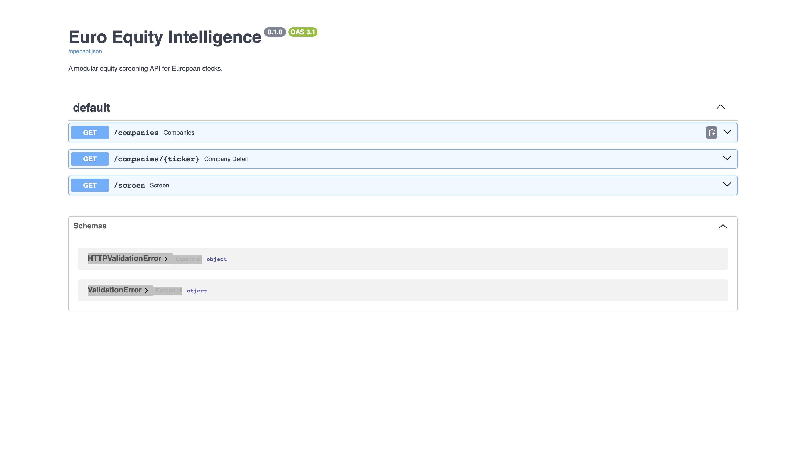

# Euro Equity Intelligence

[](https://github.com/benediktjf/EquityScreening/actions/workflows/ci.yml)

Euro Equity Intelligence is a Python 3.11 screening tool for a small universe of European equities. It fetches market and financial data from `yfinance`, calculates a set of valuation and quality metrics, applies a transparent 0-100 heuristic score for non-financial companies with sufficient data, and exposes the results through a CLI and FastAPI API.

The project is intended for financial data exploration and code review. It is not an investment engine, trading system, or recommendation service.

## Project Overview

The current universe contains 20 large European companies across Germany, France, Switzerland, the Netherlands, Spain, Italy, and the UK. For each company, the screener attempts to retrieve:

- market price data
- market capitalization and enterprise value
- income statement data
- balance sheet data
- cash flow data

Each response includes company metadata, a market snapshot, calculated metrics, a score, and data quality information.

Banks and insurers are identified by sector and are not scored by the default model. They can still be returned by company endpoints and optional screen output with `score_status = "not_scored_financials"`. Companies with very incomplete data are also excluded from ranked screens by default.

## Architecture

```text
euro_equity_intelligence/
  universe.py       Static 20-stock European universe
  data_provider.py  yfinance access layer with defensive fallbacks
  metrics.py        Financial metric calculations
  scoring.py        Heuristic 0-100 scoring model
  screener.py       Orchestration layer used by CLI and API
  api.py            FastAPI application
run_screen.py       CLI entry point
tests/              unittest suite with mocked financial data
docs/               Screenshot guide and example API response
scripts/            deterministic docs/example generator
```

The code separates data retrieval, metric calculation, scoring, and delivery. The financial calculations and scoring logic can be tested without live `yfinance` calls.

## API Documentation



## Metrics

The screener calculates:

- revenue growth
- EBITDA margin
- net debt / EBITDA
- P/E
- EV/EBITDA
- ROE
- free cash flow yield

If a metric cannot be calculated from available data, the value is returned as `null`.

## Scoring Methodology

For non-financial companies, each metric is converted into a 0-100 component score and combined with fixed weights:

| Metric | Weight | Direction | Heuristic Range |
| --- | ---: | --- | --- |
| Revenue growth | 15% | Higher is better | -10% to 20% |
| EBITDA margin | 15% | Higher is better | 0% to 30% |
| Net debt / EBITDA | 15% | Lower is better | 0x to 5x |
| P/E | 15% | Lower is better | 8x to 35x |
| EV/EBITDA | 15% | Lower is better | 6x to 20x |
| ROE | 15% | Higher is better | 0% to 25% |
| Free cash flow yield | 10% | Higher is better | 0% to 10% |

The ranges are heuristic demo ranges chosen to make companies comparable inside this small universe. They are not investment-grade valuation bands and should not be interpreted as buy/sell thresholds.

Missing metrics receive a neutral component score of `50` during calculation, but the final `score_status` determines how the result should be interpreted. Companies with too little data are not shown as normal ranked results.

The API returns a `score_breakdown` for each metric. It includes the raw metric value, the normalized component score, the metric weight, the weighted contribution, and whether higher or lower values are preferred. The final `score` is the rounded sum of the displayed weighted contributions.

| `data_completeness` | `score_status` | Default `/screen` behavior |
| ---: | --- | --- |
| `>= 0.75` | `scored` | Included |
| `>= 0.40` and `< 0.75` | `estimated_partial_data` | Included, visibly marked |
| `< 0.40` | `insufficient_data` | Excluded unless `include_unscored=true`; provider failures may appear as unscored diagnostics |
| Financial sector | `not_scored_financials` | Excluded unless `include_unscored=true` |

Financial companies are not scored by this model because bank and insurance analysis requires sector-specific metrics.

The deterministic example response in [docs/example_company_response.json](docs/example_company_response.json) is generated from fixed sample metrics by:

```bash
python3 scripts/generate_example_response.py
```

Generated score block:

```json
{
  "score": {
    "score": 63.68,
    "score_breakdown": {
      "revenue_growth": {
        "raw_value": 0.08,
        "component_score": 60.0,
        "weight": 0.15,
        "weighted_contribution": 9.0,
        "direction": "higher_is_better"
      },
      "pe_ratio": {
        "raw_value": 18.0,
        "component_score": 62.96,
        "weight": 0.15,
        "weighted_contribution": 9.44,
        "direction": "lower_is_better"
      }
    },
    "data_completeness": 1.0
  },
  "score_status": "scored",
  "data_quality": {
    "missing_metrics": [],
    "warnings": []
  }
}
```

Financial company score block:

```json
{
  "score": null,
  "score_status": "not_scored_financials",
  "data_quality": {
    "warnings": [
      "Financial companies are not scored by the default model because bank/insurance analysis requires sector-specific metrics."
    ]
  }
}
```

Insufficient-data score block:

```json
{
  "score": null,
  "score_status": "insufficient_data",
  "data_quality": {
    "missing_metrics": [
      "ebitda_margin",
      "net_debt_to_ebitda",
      "pe_ratio"
    ],
    "data_completeness": 0.29,
    "warnings": [
      "Data completeness is below 0.40; company is not included in ranked results by default."
    ]
  }
}
```

## Data Handling

`yfinance` data can be incomplete, delayed, renamed, or unavailable for some tickers. The project handles common failure modes defensively:

- missing `info` fields become empty dictionaries
- missing statements become empty data frames
- missing financial rows become `null` metrics
- duplicate statement rows and non-numeric cells are tolerated
- provider failures return a stable `insufficient_data` response with `Provider data unavailable` in `data_quality.warnings`

## How To Run

```bash
cd euro-equity-intelligence
python3 -m venv .venv
source .venv/bin/activate
pip install -r requirements.txt
```

Run the tests:

```bash
python3 -m unittest discover
```

Run the CLI:

```bash
python3 run_screen.py
```

Analyze one company:

```bash
python3 run_screen.py --ticker ASML.AS --json
```

Filter screen results:

```bash
python3 run_screen.py --min-score 70 --limit 10
```

Sort screen results:

```bash
python3 run_screen.py --sort score
python3 run_screen.py --sort data_completeness
```

Include unscored financial or insufficient-data companies in CLI output:

```bash
python3 run_screen.py --include-unscored
```

## API

Start the API:

```bash
uvicorn euro_equity_intelligence.api:app --reload
```

Open the interactive docs:

```text
http://127.0.0.1:8000/docs
```

### Endpoints

| Method | Path | Description |
| --- | --- | --- |
| `GET` | `/companies` | List the 20-stock universe |
| `GET` | `/companies/{ticker}` | Analyze one company |
| `GET` | `/screen` | Rank companies by score |

Optional `/screen` query parameters:

| Parameter | Type | Description |
| --- | --- | --- |
| `limit` | integer | Number of results, default `20`, max `50` |
| `min_score` | float | Only return companies with score >= this value |
| `include_unscored` | boolean | Include financial and insufficient-data companies excluded by default |

Example:

```bash
curl "http://127.0.0.1:8000/screen?limit=5&min_score=60"
```

Include unscored companies:

```bash
curl "http://127.0.0.1:8000/screen?include_unscored=true"
```

## Example Output

CLI table shape. Live values depend on `yfinance`, so precise scores are not hard-coded here:

```text
ticker    name          sector       score     score_status             data_completeness  missing_metrics_count  warning_count
--------  ------------  -----------  --------  -----------------------  -----------------  ---------------------  -------------
<TICKER>  <Name>        Technology   <score>   scored                   1.00               0                      0
<TICKER>  <Name>        Financials   unscored  not_scored_financials    0.86               <count>                1
<TICKER>  <Name>        Industrials  unscored  insufficient_data        0.29               <count>                2
```

Generated single-company API response excerpt:

```json
{
  "example_note": "Generated deterministic sample; not live market data.",
  "company": {
    "ticker": "EXAMPLE.DE",
    "name": "Example Industrials AG",
    "country": "Germany",
    "exchange": "Xetra",
    "sector": "Industrials"
  },
  "market": {
    "currency": "EUR",
    "market_cap": 10000000000,
    "enterprise_value": 11500000000,
    "last_close": 50.0
  },
  "metrics": {
    "revenue_growth": 0.08,
    "ebitda_margin": 0.22,
    "net_debt_to_ebitda": 1.5,
    "pe_ratio": 18.0,
    "ev_to_ebitda": 11.0,
    "roe": 0.16,
    "free_cash_flow_yield": 0.045
  },
  "score": {
    "score": 63.68,
    "score_breakdown": {
      "revenue_growth": {
        "raw_value": 0.08,
        "component_score": 60.0,
        "weight": 0.15,
        "weighted_contribution": 9.0,
        "direction": "higher_is_better"
      },
      "pe_ratio": {
        "raw_value": 18.0,
        "component_score": 62.96,
        "weight": 0.15,
        "weighted_contribution": 9.44,
        "direction": "lower_is_better"
      }
    },
    "data_completeness": 1.0
  },
  "score_status": "scored",
  "data_quality": {
    "missing_metrics": [],
    "warnings": []
  }
}
```

The full generated response is stored in [docs/example_company_response.json](docs/example_company_response.json). Live values from `/companies/{ticker}` will differ because they depend on the current `yfinance` response.

## Screenshots

Screenshot instructions live in [docs/SCREENSHOTS.md](docs/SCREENSHOTS.md).

Recommended captures:

- CLI table from `python3 run_screen.py --limit 10`
- FastAPI docs at `http://127.0.0.1:8000/docs`
- JSON response from `/companies/ASML.AS`

Store fresh captures in `docs/screenshots/`.

## Limitations

- `yfinance` data quality and availability vary by ticker, exchange, and statement field.
- The scoring model is a simplified heuristic for non-financial companies with sufficient data, not a valuation model.
- The universe is fixed at 20 European companies.
- The project does not include backtesting.
- Scores are not sector-relative yet.
- Financial companies are not scored by default. Bank and insurer analysis requires metrics such as capital ratios, net interest margin, combined ratio, or book-value-based valuation, which are not implemented yet.

## Roadmap

- Add configurable ticker universes from CSV
- Add sector-relative scoring
- Add cached data snapshots for reproducible demos
- Add financial-sector-specific metrics
- Add CI workflow for tests

## Disclaimer

This project is for software engineering demonstration and financial data exploration. It is not investment advice.
